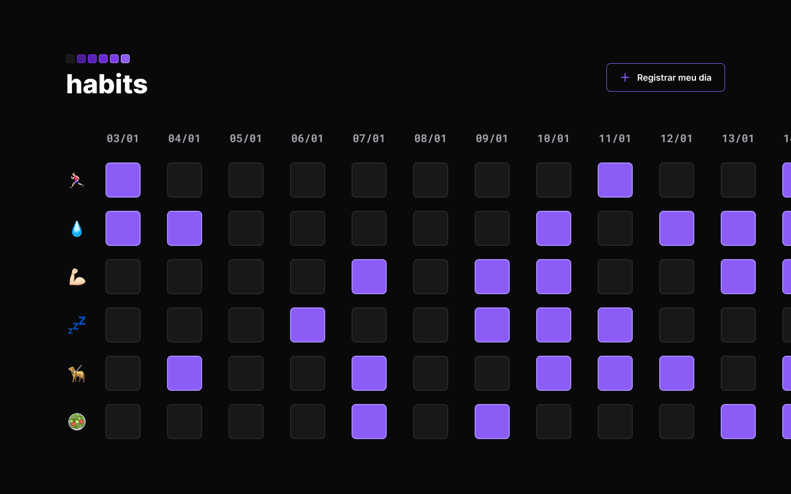

# Habits

App para usar como assistente de controle de hábitos.
-[  Visite o projeto online](https://buqueiroz.github.io/nlw-setup/)

Foram usadas as seguintes tecnologias neste projeto: HTML, CSS, JavaScript, Git e Github.